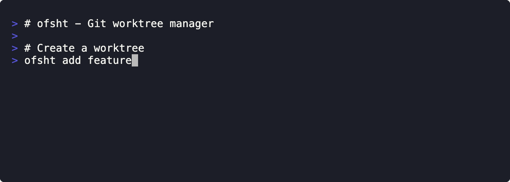

# ofsht


A command-line tool for managing Git worktrees with automation features.

## Demo



**Demonstrated features:**
- Creating worktrees with the `add` command
- Listing all worktrees with `ls`
- Configuring and executing hooks for automation
- Removing multiple worktrees with `rm`

## Table of Contents

- [Features](#features)
- [Installation](#installation)
- [Quick Start](#quick-start)
- [Usage](#usage)
  - [Basic Operations](#basic-operations)
  - [GitHub Integration](#github-integration)
  - [Shell Integration](#shell-integration)
  - [Configuration](#configuration)
  - [zoxide Integration](#zoxide-integration)
  - [tmux Integration](#tmux-integration)
  - [Shell Completion](#shell-completion)
- [Common Workflows](#common-workflows)
- [FAQ](#faq)
- [Documentation](#documentation)
- [License](#license)

## Features

**Worktree Management**
- Create worktrees from branches, tags, or commits
- List all worktrees with status information
- Navigate to worktrees by branch name
- Remove worktrees with automatic branch cleanup
- Interactive worktree selection with fzf integration

**Automation & Hooks**
- Run commands after worktree creation (e.g., `npm install`)
- Copy files from main repository (e.g., `.env`, `.nvmrc`)
- Create symlinks for shared directories (e.g., `.vscode`)
- Execute cleanup commands before worktree deletion
- Customize worktree paths with `{repo}` and `{branch}` variables

**Shell Integration**
- Automatic directory changing for `add` and `cd` commands
- Shell completion for Bash, Zsh, and Fish
- Automatic zoxide integration for quick navigation

**Configuration**
- Local configuration (`.ofsht.toml` in project root)
- Global configuration (`~/.config/ofsht/config.toml`)
- XDG Base Directory specification support

## Installation

### From crates.io (Recommended)

```bash
# Coming soon
cargo install ofsht
```

### From Binary Releases

Download pre-built binaries from the [releases page](https://github.com/wadackel/ofsht/releases).

```bash
# macOS (Apple Silicon)
curl -L https://github.com/wadackel/ofsht/releases/latest/download/ofsht-aarch64-apple-darwin.tar.gz | tar xz
sudo mv ofsht /usr/local/bin/

# macOS (Intel)
curl -L https://github.com/wadackel/ofsht/releases/latest/download/ofsht-x86_64-apple-darwin.tar.gz | tar xz
sudo mv ofsht /usr/local/bin/

# Linux (x86_64)
curl -L https://github.com/wadackel/ofsht/releases/latest/download/ofsht-x86_64-unknown-linux-gnu.tar.gz | tar xz
sudo mv ofsht /usr/local/bin/
```

### From Homebrew

```bash
# Coming soon
brew install wadackel/tap/ofsht
```

### From Source

Requires [Rust](https://www.rust-lang.org/tools/install) 1.70+:

```bash
git clone https://github.com/wadackel/ofsht.git
cd ofsht
cargo build --release
sudo mv target/release/ofsht /usr/local/bin/
```

## Quick Start

```bash
# Create a new worktree and navigate to it (with shell integration)
ofsht add feature-awesome

# Create a worktree based on a specific branch
ofsht add feature-awesome develop

# Create from a remote branch
ofsht add hotfix-123 origin/main

# Create from a tag
ofsht add release-prep v1.2.0

# List all worktrees
ofsht ls

# Navigate to a worktree (with shell integration)
ofsht cd feature-awesome

# Remove a worktree
ofsht rm feature-awesome
```

> [!TIP]
> The `add` command automatically navigates to the new worktree when shell integration is enabled. Use `create` instead if you want to stay in the current directory. See [Shell Integration](#shell-integration) for setup.

## Usage

### Basic Operations

#### Create a Worktree

`ofsht` provides two commands for creating worktrees:

- **`add`**: Creates a worktree and prints its path to stdout (for shell integration to navigate automatically)
- **`create`**: Creates a worktree but stays in the current directory (no path output)

```bash
# Create and navigate to worktree (with shell integration)
ofsht add feature-awesome
# /absolute/path/to/worktrees/my-project/feature-awesome

# Create a new worktree (stays in current directory)
ofsht create feature-awesome
# Created worktree at: ../worktrees/my-project/feature-awesome

# Create from a specific start point
ofsht add feature-awesome develop     # From branch
ofsht add hotfix-123 origin/main      # From remote branch
ofsht add release-prep v1.2.0         # From tag

# Create with tmux integration (requires running inside tmux)
ofsht add feature-awesome --tmux      # Creates worktree and opens new tmux window
```

#### List Worktrees

```bash
# List all worktrees
ofsht ls
# /path/to/my-project                                d070cdf [main]
# /path/to/worktrees/my-project/feature-awesome      d070cdf [feature-awesome]

# Show only paths (useful for scripting)
ofsht ls --show-path
# /path/to/my-project
# /path/to/worktrees/my-project/feature-awesome
```

#### Navigate to a Worktree

```bash
# With shell integration (automatic cd)
ofsht cd feature-awesome

# Without shell integration
cd $(ofsht cd feature-awesome)

# Interactive selection with fzf (when no branch name provided)
ofsht cd
```

#### Remove a Worktree

```bash
# Remove by path
ofsht rm /path/to/worktrees/my-project/feature-awesome

# Remove by branch name
ofsht rm feature-awesome

# Remove current worktree
ofsht rm .

# Remove multiple worktrees
ofsht rm feature-a feature-b feature-c

# Interactive selection with fzf (when no target provided)
ofsht rm

# Remove prunable worktrees (those whose directories have been manually deleted)
# Works with branch names, absolute paths, or relative paths
ofsht rm feature-deleted
```

> [!NOTE]
> `ofsht rm` can remove worktrees even if their directories have been manually deleted. Git marks such worktrees as "prunable" (still registered in Git but directory missing), and `ofsht` handles them gracefully by cleaning up the Git registration.

### Shell Integration

`ofsht` provides shell integration for automatic directory changing with `cd` and `add` commands.

**Setup** (one-time):

```bash
# Bash - Add to ~/.bashrc
eval "$(ofsht shell-init bash)"

# Zsh - Add to ~/.zshrc
eval "$(ofsht shell-init zsh)"

# Fish - Add to ~/.config/fish/config.fish
ofsht shell-init fish | source
```

After setup, reload your shell configuration:
```bash
source ~/.bashrc  # or ~/.zshrc for Zsh
```

**Usage** (after shell integration):

```bash
# Create and automatically navigate to the new worktree
ofsht add feature-awesome
# You're now in the new worktree directory!

# Navigate to an existing worktree
ofsht cd another-feature
# You're now in the another-feature worktree!

# Remove current worktree and return to main repository
ofsht rm .
# You're now back in the main repository!

# If you want to create without navigation, use:
ofsht create feature-awesome
```

**How it works**: The `shell-init` command generates a wrapper function that intercepts `cd`, `add`, and `rm` subcommands, automatically executing `cd` after the operation completes.

> [!CAUTION]
> The shell wrapper only works in interactive shells. You must add the `eval "$(ofsht shell-init <shell>)"` line to your shell's rc file (`~/.bashrc`, `~/.zshrc`, or `~/.config/fish/config.fish`) and reload it. The wrapper will not work in non-interactive scripts.

### Configuration

`ofsht` uses a two-tier configuration system with clear inheritance rules:

**Configuration Priority:**
1. **Local config** (`.ofsht.toml` in project root): Only `[worktree]` and `[hooks.*]` settings
2. **Global config** (`~/.config/ofsht/config.toml`): All settings, including integrations
3. **Built-in defaults**: Fallback values if no config files exist

> [!IMPORTANT]
> Integration settings (`[integration.zoxide]`, `[integration.fzf]`, `[integration.tmux]`, `[integration.gh]`) are ONLY read from global config, never from local config. Placing them in `.ofsht.toml` will silently have no effect.

#### Local Configuration

Create `.ofsht.toml` in your project root:

```toml
[worktree]
# Customize worktree directory template
dir = "../worktrees/{repo}/{branch}"

[hooks.create]
# Run commands after worktree creation
run = ["pnpm install", "echo Setup complete!"]

# Copy files from main repository
copy = [".env", ".nvmrc"]

# Create symlinks (source in repo -> destination in worktree)
link = { ".vscode" = ".vscode" }

[hooks.delete]
# Run commands before worktree deletion
run = ["echo Cleaning up..."]
```

#### Generating Configuration Files

Use `ofsht init` to generate configuration files with default settings:

```bash
# Generate both global and local config files
ofsht init

# Generate only global config
ofsht init --global

# Generate only local config (in current project)
ofsht init --local

# Overwrite existing config files
ofsht init --force
```

> [!WARNING]
> `ofsht init --force` will overwrite both global and local config files if they exist. This will destroy any existing hook configurations or custom settings. Use with caution.

#### Global Configuration

Create `~/.config/ofsht/config.toml` for global settings (or use `ofsht init --global`):

```toml
[worktree]
# Default directory template for all projects
dir = "../{repo}-worktrees/{branch}"

[integration.zoxide]
# Enable/disable zoxide integration
enabled = true  # Default: true

[integration.fzf]
# Enable/disable fzf integration
enabled = true  # Default: true

# Additional fzf command-line options
options = ["--height=50%", "--border"]

[integration.tmux]
# Configure tmux integration behavior
behavior = "auto"   # "auto" (default, flag-based), "always", "never"
create = "window"   # "window" (default) or "pane"

[integration.gh]
# Enable/disable GitHub integration
enabled = true  # Default: true
```

### GitHub Integration

When the `gh` CLI is installed and authenticated, you can create worktrees directly from GitHub issues or pull requests:

```bash
# Create worktree from GitHub issue
ofsht add #123
# Creates a worktree with branch name from the issue

# Create worktree from GitHub pull request
ofsht add #456
# Creates a worktree from the PR's head branch
```

> [!IMPORTANT]
> **Requirements for GitHub Integration:**
> - `gh` CLI must be installed (https://cli.github.com/)
> - You must be authenticated with GitHub (run `gh auth login`)
> - Command must be run inside a repository connected to GitHub
>
> Without these requirements, `ofsht add #123` will fail with "gh: command not found" or authentication errors.

The GitHub integration automatically:
- Fetches issue/PR information using `gh` CLI
- Generates appropriate branch names
- Creates the worktree with the correct base branch

To disable GitHub integration, set `enabled = false` in global config:

```toml
[integration.gh]
enabled = false
```

### zoxide Integration

When `zoxide` is installed and enabled (default), created worktrees are automatically registered with zoxide for quick navigation:

```bash
# After creating a worktree
ofsht add feature-awesome
# or
ofsht create feature-awesome

# You can now jump to it using zoxide
z feature-awesome

# Disable zoxide integration in global config (~/.config/ofsht/config.toml)
[integration.zoxide]
enabled = false
```

### tmux Integration

`ofsht` can automatically create tmux windows or panes when creating worktrees.

**Configuration Options:**

```toml
# In ~/.config/ofsht/config.toml
[integration.tmux]
behavior = "auto"   # or "always", "never"
create = "window"   # or "pane"
```

- **`behavior`**:
  - `"auto"` (default): Only use tmux when `--tmux` flag is specified
  - `"always"`: Automatically create tmux window/pane for every worktree
  - `"never"`: Disable tmux integration entirely

- **`create`**:
  - `"window"` (default): Create a new tmux window
  - `"pane"`: Split current window horizontally

**CLI Overrides:**

```bash
# Temporarily enable tmux (overrides config)
ofsht add feature-awesome --tmux

# Temporarily disable tmux (overrides config, even with behavior="always")
ofsht add feature-awesome --no-tmux

# With behavior="always" in config, tmux is used by default
ofsht add feature-awesome  # Creates tmux window/pane automatically
```

> [!CAUTION]
> tmux integration requires running `ofsht add` inside an active tmux session. Using `--tmux` flag or `behavior = "always"` outside of tmux will fail with an error. Remote sessions via SSH must preserve the `$TMUX` environment variable.

**Window/Pane Behavior:**
- New windows are automatically focused and set to the worktree directory
- Window names are sanitized from branch names (e.g., `"feature/login"` → `"feature·login"`)
- Panes are created with horizontal split in the current window

**Requirements:**
- Must be running inside a tmux session when tmux integration is active
- tmux binary must be available in PATH

### Shell Completion

`ofsht` provides dynamic shell completion with smart branch and worktree name suggestions.

To see setup instructions for your shell:

```bash
# Display setup instructions
ofsht completion bash    # For Bash
ofsht completion zsh     # For Zsh
ofsht completion fish    # For Fish
```

**Quick setup**:

```bash
# Bash - Add to ~/.bashrc
source <(COMPLETE=bash ofsht)

# Zsh - Add to ~/.zshrc
source <(COMPLETE=zsh ofsht)

# Fish - Add to ~/.config/fish/config.fish
source (COMPLETE=fish ofsht | psub)
```

After setup, you'll get intelligent completions:
- `ofsht add feature <TAB>` - When specifying a start point, lists branches, remote refs, and tags
- `ofsht rm <TAB>` - Lists worktree names (and flags, following standard CLI conventions)
- `ofsht cd <TAB>` - Lists worktree names

## Common Workflows

### Working on Multiple Features Simultaneously

```bash
# Create worktrees for different features
ofsht add feature-authentication
ofsht add feature-dashboard
ofsht add bugfix-login-issue

# Switch between them easily
ofsht cd feature-authentication  # Work on authentication
ofsht cd feature-dashboard        # Switch to dashboard
ofsht cd bugfix-login-issue       # Fix the bug

# Or use zoxide for quick navigation
z authentication
z dashboard
z login
```

### Code Review Workflow with GitHub PR Integration

```bash
# Review a pull request
ofsht add #123                    # Create worktree from PR #123
# Review code, run tests, etc.
ofsht rm .                        # Remove and return to main repo

# Work on an issue
ofsht add #456                    # Create worktree from issue #456
# Implement the feature
git push                          # Push changes
ofsht cd main                     # Return to main branch
ofsht rm 456                      # Clean up the worktree
```

### Maintenance Cycle: Create → Test → Cleanup

```bash
# Create a new feature branch
ofsht add feature-new-api

# Run setup hooks automatically (defined in .ofsht.toml)
# - npm install / pnpm install
# - Copy .env and other config files
# - Link shared directories

# Do your work, test, commit
git add .
git commit -m "feat: add new API endpoint"
git push

# Return to main and clean up
ofsht cd main
ofsht rm feature-new-api          # Hooks run cleanup commands

# Or clean up from within the worktree
ofsht rm .                        # Automatically returns to main repo
```

### Managing Multiple Projects

```bash
# Configure global worktree directory template
# in ~/.config/ofsht/config.toml:
# [worktree]
# dir = "~/worktrees/{repo}/{branch}"

# Now all projects use consistent structure:
# ~/worktrees/project-a/feature-x
# ~/worktrees/project-b/feature-y
# ~/worktrees/project-c/bugfix-z
```

## FAQ

### What's the difference between `add` and `create`?

- **`add`**: Creates a worktree and prints its path to stdout, enabling shell integration to automatically navigate to it
- **`create`**: Creates a worktree but stays in the current directory, useful for scripting or when you don't want to navigate

With shell integration enabled (`eval "$(ofsht shell-init bash)"`), `add` will automatically `cd` to the new worktree.

### Do I need to install zoxide, fzf, or tmux?

No, all integrations are optional:
- **zoxide**: If not installed, worktrees are created normally without zoxide registration
- **fzf**: If not installed, interactive selection commands (`ofsht cd` / `ofsht rm` without arguments) will show an error
- **tmux**: Only required if you use the `--tmux` flag or set `behavior = "always"` in config

> [!TIP]
> All integrations gracefully degrade if the tools are not available. You can install them later and they'll automatically work without any configuration changes. Start using `ofsht` right away and add integrations as needed.

### Can I use ofsht with GitHub Desktop or other Git GUIs?

Yes! `ofsht` uses standard `git worktree` commands under the hood, so all worktrees are visible to Git GUIs. However, features like hooks and integrations are specific to the `ofsht` CLI.

### What happens if I manually delete a worktree directory?

Git marks manually deleted worktrees as "prunable". You can still remove them with `ofsht rm <branch-name>`, which will clean up the Git registration. The deletion hooks won't run since the directory is already gone.

### Why use ofsht instead of plain `git worktree`?

`ofsht` enhances `git worktree` with:
- **Automation**: Hooks for running commands, copying files, and creating symlinks
- **Better UX**: Interactive selection with fzf, shell integration for auto-navigation
- **Integrations**: Automatic zoxide registration, tmux window creation, GitHub issue/PR support
- **Configuration**: Project-specific and global settings for consistent workflows

Think of it as `git worktree` with quality-of-life improvements for daily development workflows.

### How do I migrate from using plain `git worktree`?

Your existing worktrees created with `git worktree add` are fully compatible with `ofsht`:
- `ofsht ls` will show all worktrees
- `ofsht cd <branch>` can navigate to existing worktrees
- `ofsht rm <branch>` can remove worktrees created with `git worktree add`

Simply start using `ofsht add` for new worktrees to take advantage of hooks and integrations.

## Documentation

- [CONTRIBUTING.md](./CONTRIBUTING.md) - Development guide and architecture details
- [CHANGELOG.md](./CHANGELOG.md) - Version history
- [TEST.md](./docs/TEST.md) - Manual testing procedures

## License

[MIT © wadackel](./LICENSE)
